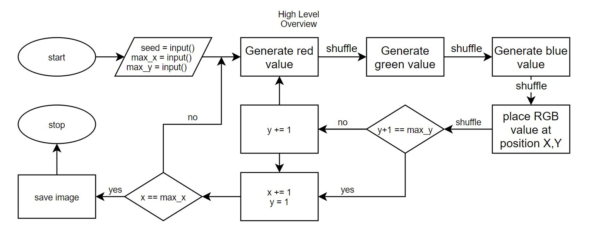

# image-from-seed
Create an image of width X and height Y from a seed.

## Creation process

1) gather all user input
    - seed
    - Image width
    - Image height

2) use seed to generate all of our colour values
    - the seed is shuffled every time a new color is made to ensure that the red, green and blue are unique (3 shuffles per colour)

3) begin placing pixels
    - the order of pixel placement goes from top to bottom, left to right. For example:
        * start at top left
        * write every pixel from top left to bottom left
        * move along 1 pixel
        * do the same thing

4) Done!

## Reversing an image

WIP.
